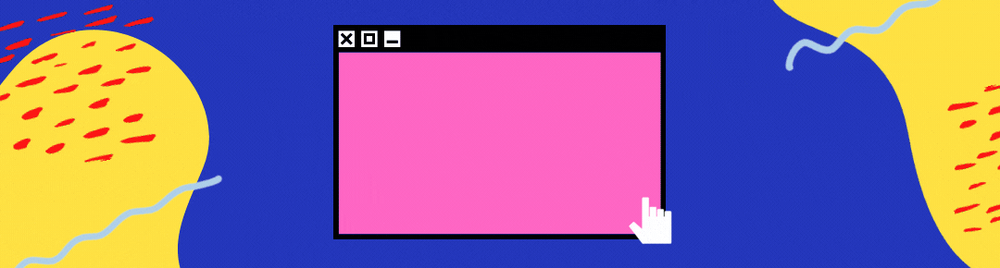

<h1 align='center'>Welcome! :wave:</h1>

<!--
**iammobina/iammobina** is a ✨ _special_ ✨ repository because its `README.md` (this file) appears on your GitHub profile.

Here are some ideas to get you started:

- 🔭 I’m currently working on a machine translation project.

- ✨ I’m interested in Deep Learning , Computer Vision , Natural Language Processing and Machine Learning.

- 📫  You can reach me via email : mobina.km@gmail.com
- 🔭 I’m currently working on ...
- 🌱 I’m currently learning ...
- 👯 I’m looking to collaborate on ...
- 🤔 I’m looking for help with ...
- 💬 Ask me about ...
- 📫 How to reach me: ...
- 😄 Pronouns: ...
- ⚡ Fun fact: ...
-->

<h1 align="center"> I'm Mobina Kashaniyan</h1>

<!-- 
  
 -->

 
 

- 👨‍💻 All of my projects are available at [https://github.com/iammobina](https://github.com/iammobina)
- 📫 How to reach me **mobina.km@gmail.com**
- 📝 My personal website [https://iammobina.github.io/](https://iammobina.github.io/) 
- 🖋 Connect with me:

<h2 align="left">Status: </h2>

<!--  

   -->
