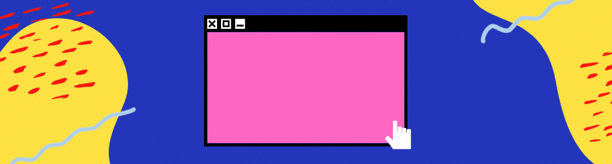

<h1 align="center">Hi, I'm Mobina Kashaniyan 👋</h1>

  

  Computer Science graduate student interested in Machine Learning, Deep Learning, NLP, Computer Vision, and data-driven research.

---

### About Me

- 👩‍💻 All of my projects are available on [GitHub](https://github.com/iammobina)
- 🌐 Personal website: [iammobina.github.io](https://iammobina.github.io/)
- 📫 Email: **mobina.km@gmail.com**
- 💼 Connect with me on 
  

---

### GitHub Highlights

  

---

### GitHub Stats

  

  

